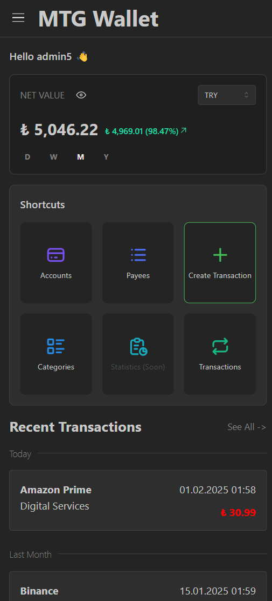
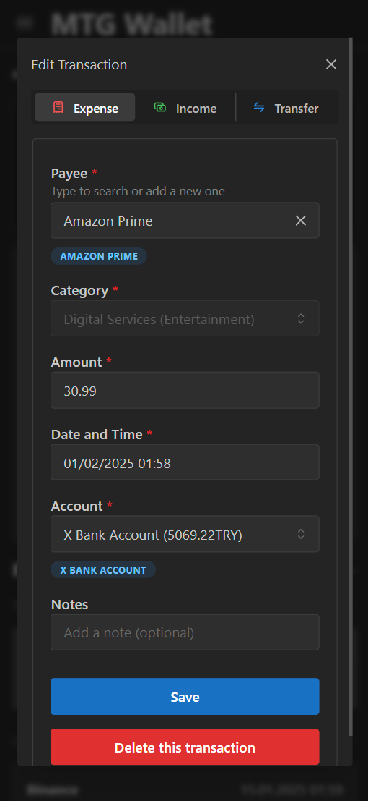
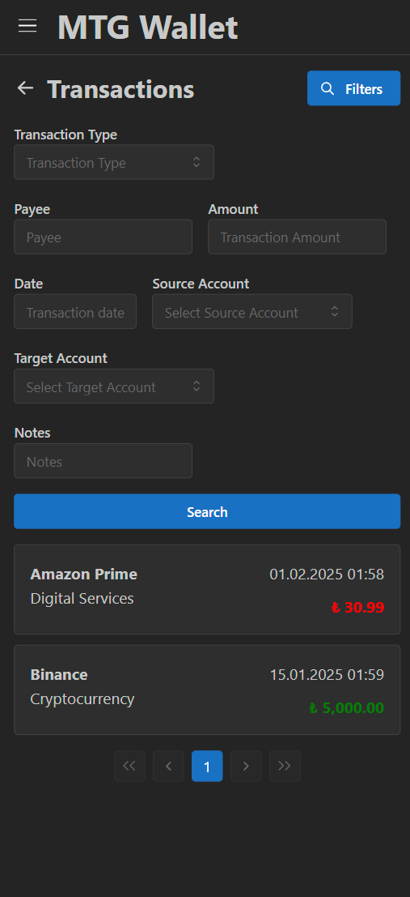
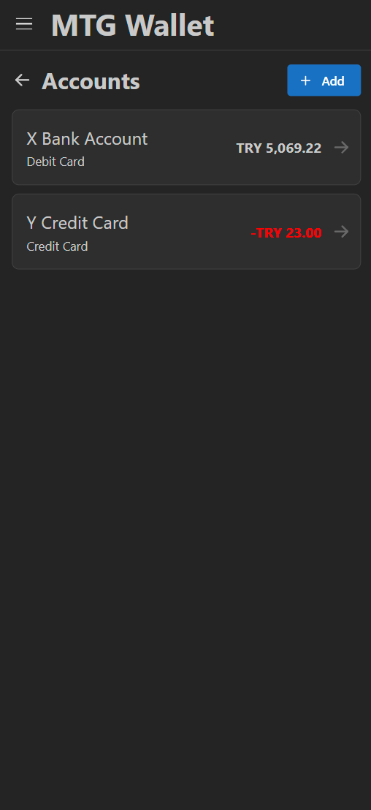

# MTG Wallet FE

MTG Wallet FE is frontend application for [MTG Wallet BE](https://github.com/TolgaGolet/mtg-wallet-be) designed to keep
track of your daily transactions, account balances, and much more in the future.

## 🌟 Features

- **Transaction Tracking**: Record, categorize and view transaction history
- **Account Balances**: Keep track of your accounts' balances easily
- **Profits and Losses**: Calculate your profits and losses by different intervals
- **Account Security**: Secure account system with Spring Security JWT
- **Email Verification**: Email verifications while registering and account recovery processes
- **Two-Factor Authentication (2FA)**: Secure login system with a TOTP
- **Rate Limiting**: Rate limiting for preventing abuse
- **Auditing:** Easy auditing entity listener
- **Service Logging:** Aspect oriented service logging with an annotation
- **Exception Logging:** Exceptions are logged automatically for debugging
- **Health Monitoring:** Health can be monitored through [status page](https://kk23vgsq.status.cron-job.org/)
- **Responsive Design:** Designed to be compatible on mobile devices with Mantine

## 🚀 Live Demo

Live demo at: https://mtgwallet.onrender.com

## 📸 Screenshots

## 🛠️ Technology Stack

- **ReactJS**
- **react-router-dom**
- **Mantine**

## 🚦 Getting Started

### Prerequisites

- NodeJS
- NPM

### Configuration

1. Uncomment .env for local use
